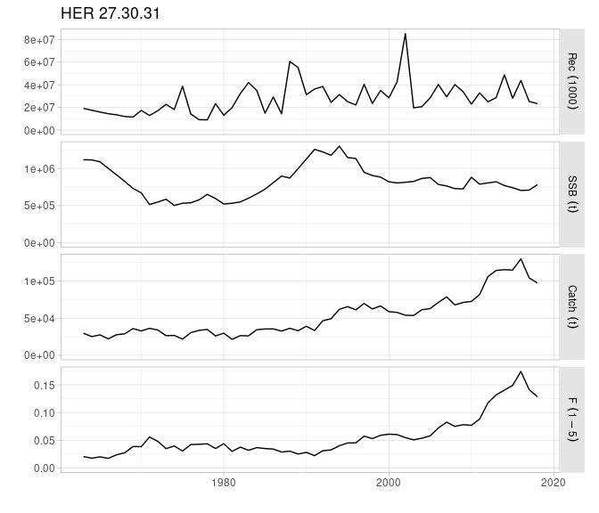
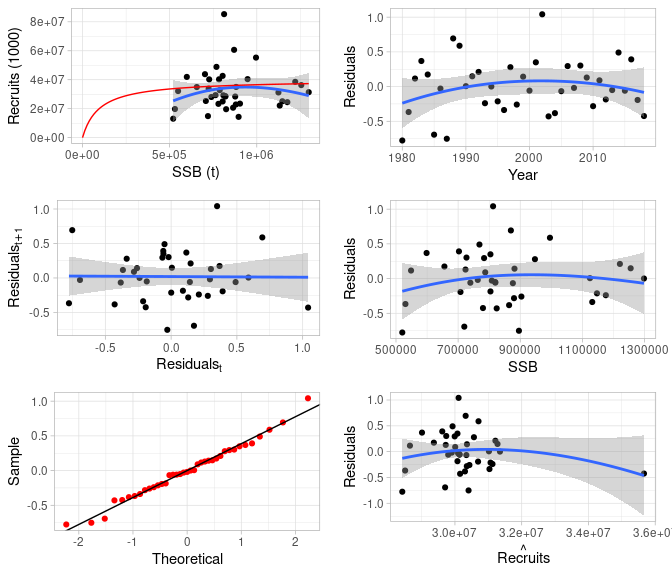

# ss3om 

[](https://github.com/flr/ss3om/actions)
[](https://eupl.eu/1.2/en/)

## Overview
Tools for loading Stock Synthesis (SS3) models into FLR. Used in conditioning of Operating Models based on SS3 by considering structural uncertainty in input parameters and assumptions. A grid of SS3 runs can be created and results loaded on objects of various classes, ready for use in FLR.

## Installation
To install this package, and all its dependencies, start R and enter:

```
  install.packages("ss3om", repos=structure(
    c(CRAN="https://cloud.r-project.org/", FLR="https://flr-project.org/R")))
```

or directly from the github repository by first updating to the latest version of [r4ss](https://github.com/r4ss/r4ss):

```
  remotes::install_github("r4ss/r4ss")
  remotes::install_github("flr/ss3om")
```

## Usage

Different FLR objects can be loaded from a folder containing the output of an SS3 run.

```{r}
dir <- system.file("ext-data", "herring", package="ss3om")
```


To create an *FLStock* object from a model run, we can call *readFLSss3*,

```{r}
stk <- readFLSss3(dir)

plot(stk)
```



and to extract and convert the stock-recruit relationship, you can use

```{r}
srr <- readFLSRss3(dir)

plot(her)

```




## License
Copyright (c) 2016-2022 European Union & Iago Mosqueira. Released under the [EUPL 1.2](https://eupl.eu/1.2/en/).

## Contact
You are welcome to:

- Submit suggestions and bug-reports at: <https://github.com/flr/ss3om/issues>
- Send a pull request on: <https://github.com/flr/ss3omn/>
- Maintainer: Iago Mosqueira (WMR) <iago.mosqueira@wur.nl>
